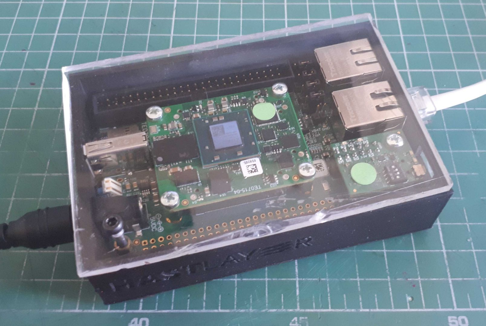
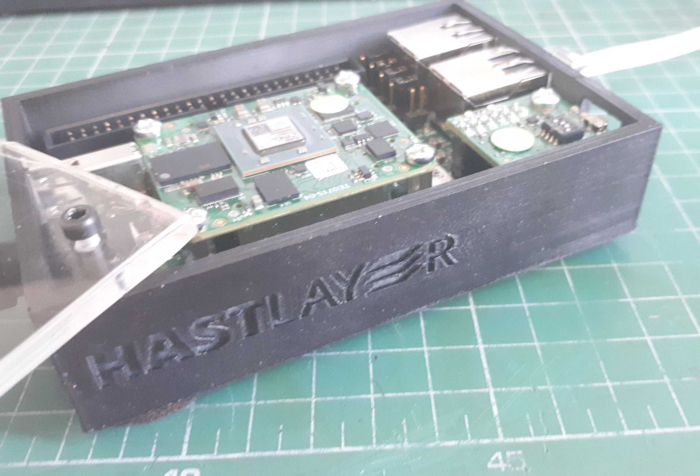
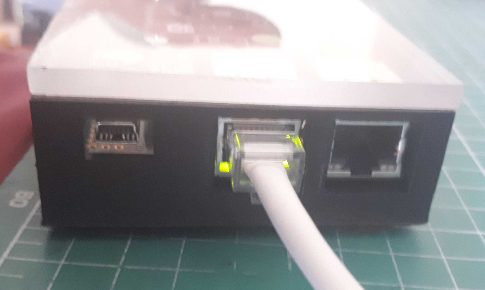
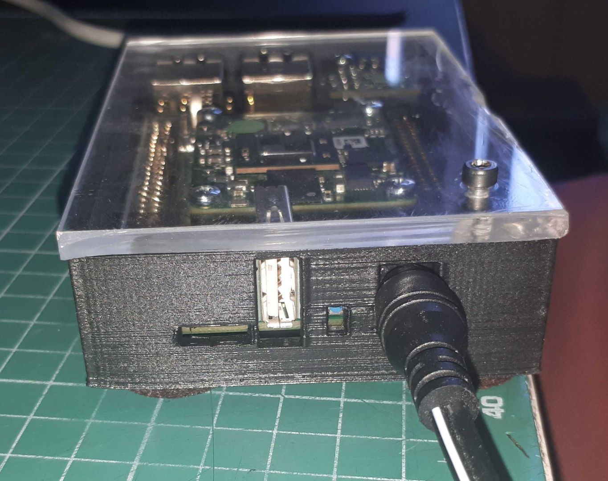

# Trenz TE0706-03 Zynq carrier board chassis

A chassis for the [Trenz TE0706-03](https://shop.trenz-electronic.de/en/TE0706-03-TE0706-Carrierboard-for-Trenz-Electronic-Modules-with-4-x-5-cm-Form-Factor) carrier board without the optional DIN 41612 port installed. We use it for development on [Hastlayer](https://hastlayer.com) for the upcoming [Xilinx Zynq-7000](https://www.xilinx.com/products/silicon-devices/soc/zynq-7000.html) support.

## Printing:

Used Cura's default settings for my Anycubic I3 Mega. Needs support for the port holes.

The top is a flat rectangle with a hole for the hinge, you can use any sheet material and the bottom as a template. I've used some leftover acrylic sheet.

_Hastlayer is a property of Lombiq Technologies Ltd._

## Customization

The [OpenSCAD](https://openscad.org/) source file is available at the _TE0706 carrier board_ directory on my [GitHub repository](https://github.com/DAud-IcI/3d-printing/). The files there are licensed under [LGPL](https://raw.githubusercontent.com/DAud-IcI/3d-printing/main/LICENSE).

## Thingiverse

You can also find the STL at Thingiverse [here](https://www.thingiverse.com/thing:4933893) (pending approval).

## Images

- 
- 
- 
- 

## Attribution

The brushless DC fan used for reference during the fan intake design is by [Umberto Arena](https://grabcad.com/library/fan_bb5015h12-1)